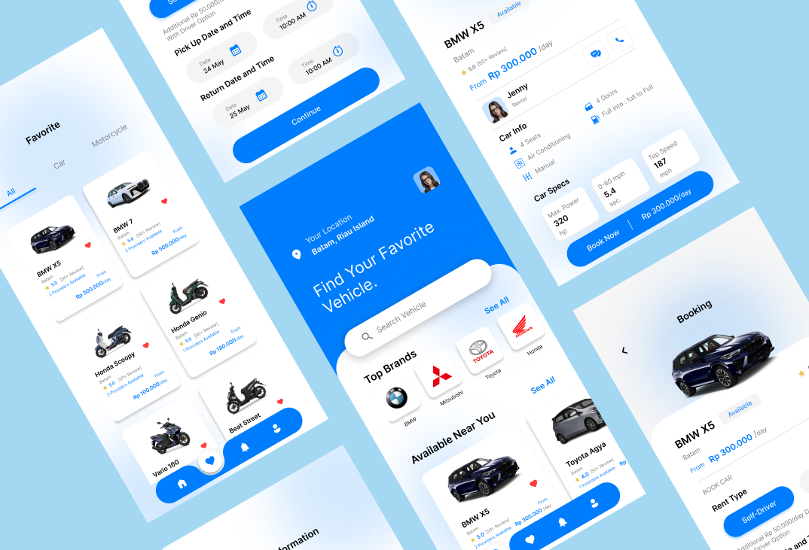

# MotoCar Rental – Car Rental Application UI/UX Design

Motocar Rental is a UI/UX design project developed as part of the User Interface Experience course. The project focuses on creating a digital solution for renting motorcycles and cars through a simple and user-friendly interface. The main objective is to streamline the booking process, allowing users to browse available vehicles, access detailed information, and complete reservations easily. The design highlights clarity, consistency, and ease of navigation to ensure a smooth user experience. Attention is given to how information is structured and how users interact with each feature throughout the booking flow. This project reflects the ability to design practical interfaces that address real-world needs while maintaining usability and efficiency.

## 📸 Design Preview

